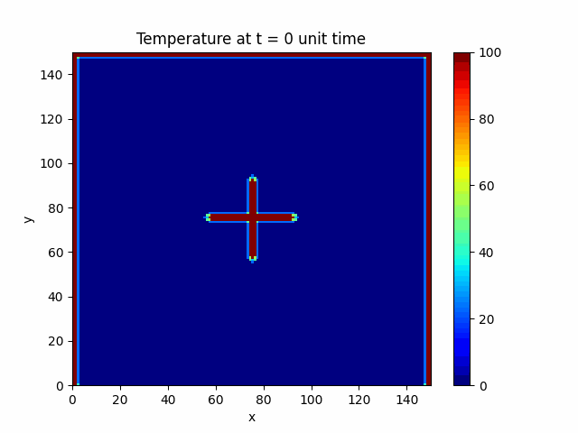

# OpenMP
## OpenMP MIPT tasks

### Completed tasks
 - hello - Printing "hello world" string by several threads
 - sum - Computing sum from 1 to N by several threads
 - vecproc - Transform a[i] to (a[i-1]+a[i]+a[i+1])/3 inplace and with extra memory
 - matmul - Matrix multiplication (block mode + simple)
 - exp - Taylor for exponent and cosine
 - simples - Parrallel simple numbers search on the range from 1 to N
 - qsort - Parallel qsort
 - sort - Qsort with Batcher odd-even merge (not finished)
 - heat - Parallel numerical solution of heat equation
 - example - Just an example

--help is available for each binary


### Build
```bash
$ mkdir build; cd build
$ cmake path/to/this/dir
$ make
```

### Heat:
```bash
$ /path/to/build/heat/heat -n 100 -m 100 --frames 100 -j 4 > frames.txt
$ python3 /path/to/scripts/colormap.py --frames 100 --input frames.txt 
```


